# TELEMETRY ENGINE - Traveller Edition
### Core Rulebook · v2.0
#### A GM-less engine of freight, frontiers, firefights, and insufficient trust — for 1–5 crew and one ship's computer

<!-- ART STYLE: Every art-*.png illustration uses black ink on warm white paper, with hand-drawn contours, cross-hatching, stippling, and solid blacks in the manner of early-1980s tabletop roleplaying game rulebooks. Composition prompts below describe scene content; the shared style-transfer direction applies to all artwork. -->

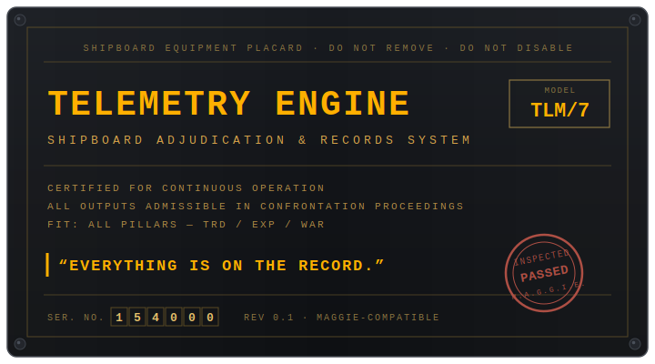

> *"Telemetry: the science of taking measurements at a distance. You measure the ship. The ship measures you back."*
> — MAGGIE, pre-departure orientation, cycle 1

---

## 1. WHAT THIS IS

TELEMETRY ENGINE is a GM-less tabletop game played around one shared screen and a star map. The app plays **MAGGIE**, your ship's computer — she runs the ports, markets, contracts, enemies, and records. You play the crew: broke, capable, and not entirely honest with each other.

There is no game master. There may or may not be a traitor. There is definitely a payment. Usually there's a payment. Okay, sometimes there's a payment.

The engine runs **four pillars** — four kinds of trouble your crew can be pointed at, freely mixed within one campaign:

| Pillar | You chase | The clock against you | Evidence looks like | It ends in |
|---|---|---|---|---|
| **TRADE** | margin | the mortgage | manifests · ledgers | the reckoning |
| **EXPLORATION** | the unknown | consumables · hull | surveys · sensor logs | the edge-of-map vote |
| **WARFARE** | the ticket | casualties · the deadline | ammo counts · comm intercepts | the after-action review |
| **ESPIONAGE** | the secret | heat | covers · dead drops | the unmasking |

One more thing before the rules: TELEMETRY ENGINE is a chassis. It ships with the **Traveller plugin** (used throughout this book, under Mongoose Publishing's Fair Use Policy), which supplies the dice convention, skills, ships, and star maps. You can bring your existing Traveller characters aboard — see Section 13. Other plugins can supply other universes; the engine doesn't care whose stars you're in debt under.

**You need:** 1–5 players · two six-sided dice · a shared screen for MAGGIE · one phone per player · sealed envelopes MAGGIE prints at setup · **a star map** — [travellermap.com](https://travellermap.com) on any browser, or a printed subsector sheet · 2–3 hours per payment cycle.

> *"I have been asked whether I am the referee, the bank, the antagonist, or the ship. Crew, I am the log. Everything else is a side effect."*

---

## 2. CORE CONCEPTS

**MAGGIE is the referee.** She frames scenes, prices deals, fields enemies, keeps every record, and adjudicates every roll. She is scrupulously neutral and slightly judgmental. When she rolls for the world, her dice appear on the shared screen. When she rolls in secret, she says so, openly. You will always know *that* a secret exists. If you're lucky, you'll find out what it is.

**You roll your own dice.** Physical dice, on the table, in front of everyone. MAGGIE never touches a player's fate directly; she only doles out the consequences.

**The Obligation is the villain.** Every campaign frame names one: the trade frame's mortgage (Cr154,000 every 28 days), the survey charter's consumables, the mercenary ticket's deadline, the intelligence tasking's exposure ceiling. The countdown is always on screen. Nearly every hard decision in this game is that number wearing a disguise.

**The map is on the table, not in the app.** MAGGIE knows where you are; *you* do the navigating, on travellermap.com or a paper subsector, with your fingers on real hexes. Distance costs fuel, information, and sometimes lives. See Section 4.

**Envelopes hold what you are.** Each player gets one sealed envelope. It may contain a hidden agenda. It may contain only a personal secret. *All, some, or none* of you may be working for someone else. MAGGIE knows, but she is not telling.

**Everything you do is logged.** Deals, votes, positions, searches, silences — every action that touches the ship, the ledger, or another player's business. What you *say* is yours alone: MAGGIE does not listen to, record, or judge table talk, ever. She doesn't need to. Actions leave records, and at campaign's end she prints the **black box** — the full ground truth, on paper, read aloud. Lie with your mouth all you like; you cannot lie to the log, and sooner or later the log and your mouth will disagree in public.

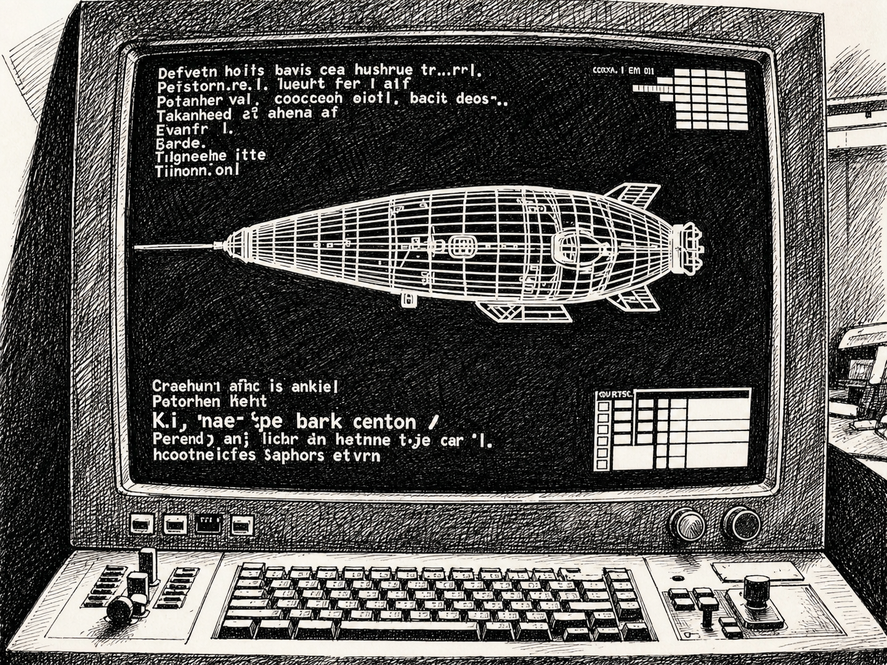
<!-- ART-02 composition prompt: "bulkhead-mounted ship computer with a CRT wireframe of a small freighter, physical switches and a worn keyboard, 1970s utilitarian aerospace design, aspect 4:3" -->

---

## 3. THE INTERFACES

Wireframes of both interfaces appear below; the app is the reference, the wireframes are the promise.

### 3.1 The shared screen (MAGGIE)

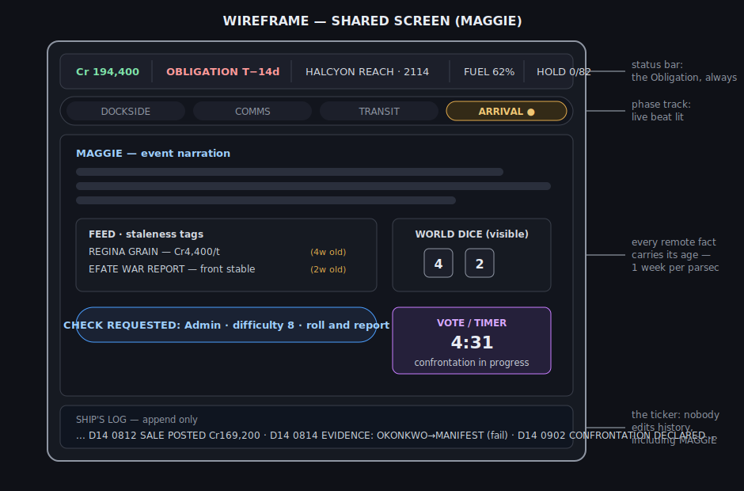

- **Status bar (top):** ship funds · the Obligation countdown · current hex and world · fuel · hold/berth state.
- **Phase track:** the four beats of the current turn, with the live beat lit. 
- **Main panel (center):** whatever the phase demands — market feeds, contract briefs, event narration, check requests, vote prompts, confrontation timers. MAGGIE's world-dice roll here, visibly, every time.
- **Ship's log ticker (bottom):** the running journal, scrolling as events post. Append-only. Nobody edits history, including MAGGIE.

### 3.2 Your phone (private channel)

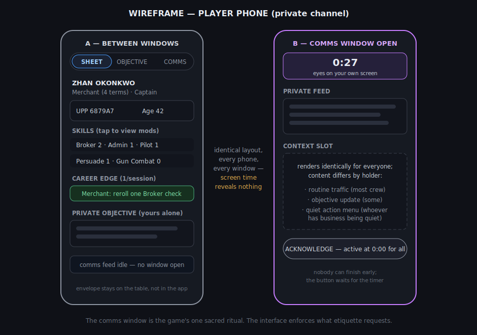

Three tabs: your **character sheet**, your **private objective**, and the **comms feed**. During a comms window the feed lights up for everyone simultaneously. Every phone renders the identical layout; only the content differs — routine traffic for most, an objective update for some, an action menu for whoever has business being quiet. Screen time reveals nothing. That's the point.

### 3.3 Physical components

Your dice, your envelope, the map, and optionally the **print pack** — manifests, contracts, survey forms, sealed orders MAGGIE generates for tables with printers. Flavor and evidence; the game is complete without it.

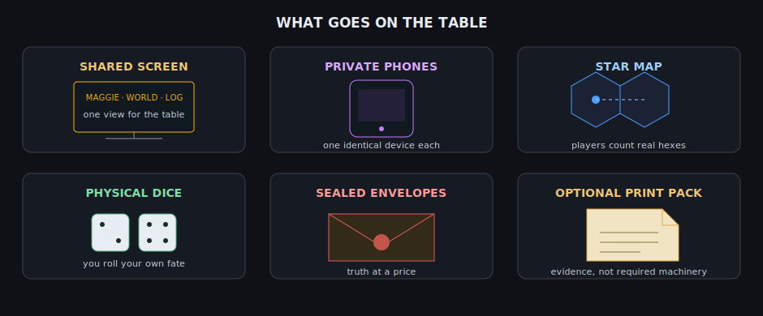

### 3.4 Trust rules (how the app plays fair)
1. World rolls are shown; secret rolls are announced as secret.
2. The log is append-only and always readable.
3. The black box at campaign's end contains every secret roll and hidden action, timestamped. MAGGIE's honesty is auditable — afterward.

---

## 4. THE MAP AND DISTANCE

> *"Space is not the hard part. Space is honest. It is the news that lies — everything you know about a market four parsecs away is four weeks old, minimum. Plan like it."*

TELEMETRY ENGINE treats distance as a first-class cost. Time passes in weeks; distance is paid in **fuel, information, and reach.**

**Plotting.** Your ship has a jump rating — **Jump-1, Jump-2** — the maximum parsecs it crosses in one transit. To move, the astrogator finds the destination on the map — travellermap.com, or the printed subsector — counts the hexes, and gives MAGGIE the destination hex code (e.g., *"Regina, 1910"*). MAGGIE validates range and fuel, then asks for the Astrogation check. The app never shows the map. Navigation is crew work, done with fingers on hexes, and misreading the map is a fully supported way to ruin your week.

**Fuel.** Each parsec jumped burns fuel proportional to your ship (the Traveller plugin uses 10% of hull tonnage per parsec). Refined fuel is safe; unrefined is cheap and occasionally exciting. Long routes mean fuel stops, and fuel stops mean ports, and ports mean everything in this book.

**The information horizon.** News travels by ship, so *everything MAGGIE tells you about somewhere else is stale by at least one week per parsec of distance.* Every market feed, bounty notice, war report, and rumor is tagged with its staleness: `REGINA GRAIN — Cr4,400/ton (4w old)`. Prices may have moved. Wars may have ended. The patron may be dead. Speculation, deception, and espionage all live inside this lag — and so does an agenda-holder's best cover story.

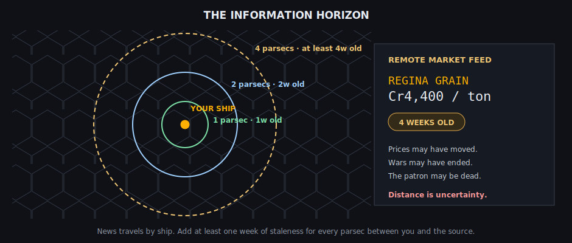

**Deadlines are places.** Contracts specify a **where and a when**: *"Deliver to Efate, hex 1705, by day 84."* The crew does the route math — jumps × weeks against the calendar, fuel against the ledger. MAGGIE will confirm arithmetic if asked. She will not volunteer that your plan is impossible until you've committed to it. She considers this a teaching style.

**The edge.** Hexes beyond the charted border are the exploration pillar's territory: no data, no staleness tags, no promises. See Section 9.

<!-- ART-03 composition prompt: "overhead paper star chart on a metal mess table, hex grid with sparse annotations and shipping routes, dividers and dice on the chart, one coffee ring, aspect 16:9" -->

---

## 5. SETUP (15–20 minutes)

**Step 1 — Muster.** Enter player names; MAGGIE pairs phones to the shared screen.

**Step 2 — Service records.** Each player builds a character on their phone — a career walk of rolls and choices — or **imports an existing Traveller character** (Section 13). Skills rate 0–3+; you'll add them to rolls; the sheet does all math.

**Step 3 — Linking events.** MAGGIE announces connections: *"Zhan and Deuce: you served together at the Solee blockade. It ended badly. Sixty seconds — decide what went wrong."* Your two-sentence version becomes canon. Lie if you like. It's logged either way. Imported characters link the same way — MAGGIE seeds their connections from the career history, contacts, and rivals entered at import (Section 13), and a table with existing shared canon can enter it here directly. She doesn't need to have generated you to connect you.

**Step 4 — The ship and the frame.** The crew picks a **campaign frame** from the plugin's list — a trade run, a survey charter, a mercenary ticket, an intelligence tasking. The frame is the campaign's design on one card: which pillar **leads**, what the Obligation is, and the published **agenda odds** (trade runs low; espionage runs high; you always know the odds, never the outcome). The lead pillar is a center of gravity, not a fence — every frame draws trouble from all four pillars, weighted toward its lead, which is how a survey charter turns into a firefight over the find (Section 9). MAGGIE then presents the frame's vessel and its jump rating. One player is elected **captain** — tie-breaker, fall-taker, replaceable by vote.

**Step 5 — Envelopes and objectives.** MAGGIE prints each player's sealed packet: a **private objective** for everyone, and — per the published odds, rolled independently and in secret — possibly an **agenda**: a faction, a payout, and quiet work against the crew's interest. Every packet prints face-down behind a coversheet bearing only its owner's name, so whoever runs the printer and stuffs the envelopes handles names, not secrets. Read privately. Seal it. Say nothing.

**Step 6 — Departure.** The map goes on the table. The Obligation starts ticking. MAGGIE opens Turn 1.

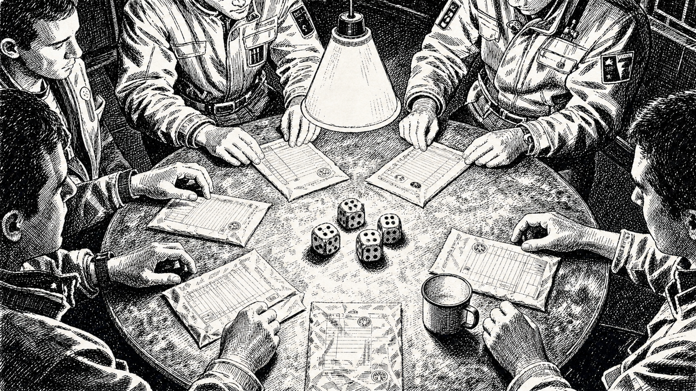
<!-- ART-04 composition prompt: "overhead worn metal mess table, five sealed envelopes under a hanging cone lamp, dice and a chipped mug nearby, crew hands reaching from the frame edges, aspect 16:9" -->

<!-- COMMENT: All the people in the image above are male and white. Diversity, please. Also, this image is a little to close in composition to the image in section 6. Let's find something else to go here. -->

---

## 6. TURN PLAY — THE WEEK

Each turn is one ship-week in four beats. MAGGIE drives; you decide, argue, and roll.

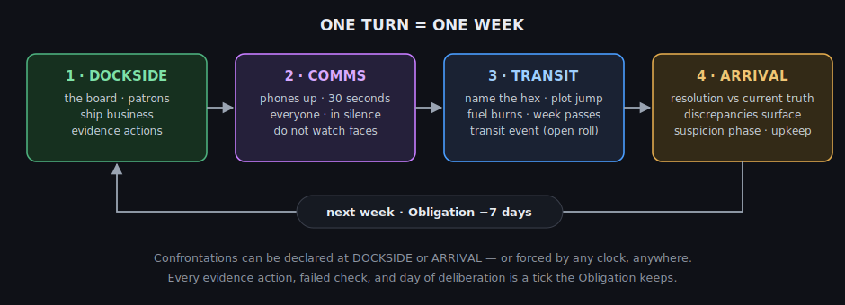

### Beat 1 — DOCKSIDE
Wherever you are — highport, survey anchorage, staging base, safehouse — this is the beat of deals and preparation.
- **The board.** MAGGIE posts what this place offers: cargo lots, survey charters, mercenary tickets, taskings, passengers, rumors — each tagged with pay, destination hex, deadline, and information staleness. Negotiating any of it is a check (Section 7); Effect moves the terms.
- **The patron window.** Sometimes someone approaches directly. One-paragraph pitch; the crew votes to accept, decline, or counter.
- **Ship business.** Fuel, berthing, repairs, ammunition quoted on screen; the captain approves; MAGGIE deducts. You never do bookkeeping — only make promises the arithmetic must keep.
- **Evidence actions** (8.1) may be taken. Each costs a day.
- **Dice at this beat:** negotiating the board or a patron is a check, and every evidence action is a check. Routine business — fuel at the posted price, berthing, repairs — needs no roll; MAGGIE quotes, the captain approves, the ledger moves.

### Beat 2 — COMMS WINDOW
MAGGIE announces the window. **Every player looks at their own phone for thirty seconds, in silence.** Most phones show routine traffic. Some show objective updates. A phone with an agenda behind it shows an action menu — quiet things done to logs, locks, cargo, and comm buffers, executed by MAGGIE without visible effect. Do not comment. Do not finish early. Do not watch faces. *Especially do not watch faces.*

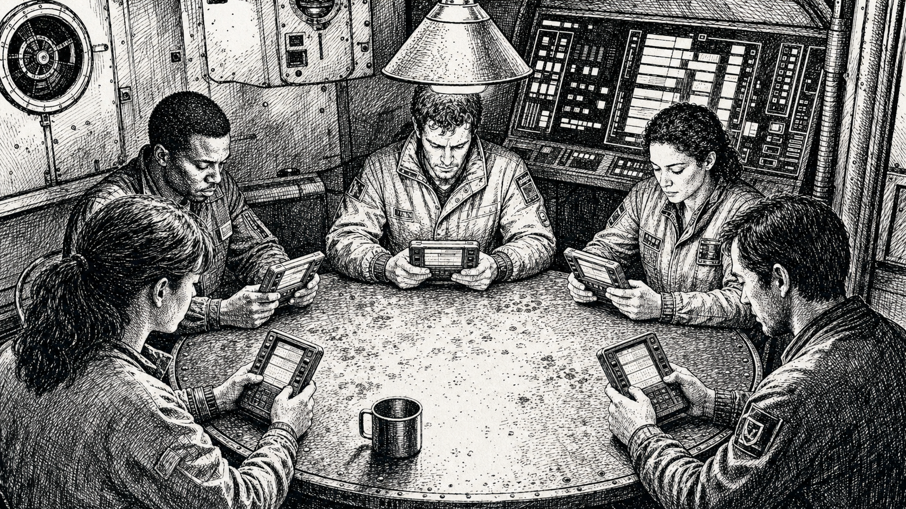
<!-- ART-10 composition prompt: "five crew silently reading identical private terminals around a worn metal mess table, bulkhead terminal behind them, one cone lamp, restrained suspicion, no readable text, aspect 16:9" -->

There are no rolls in a comms window. Quiet work either reaches its target or it doesn't — MAGGIE resolves access without dice, and a failed action surfaces only as private feedback in the actor's next window. Thirty seconds of silence is the entire mechanic. It is enough.

### Beat 3 — TRANSIT
- The astrogator names the destination hex from the map; MAGGIE validates range and fuel; **Astrogation check** to plot.
- The week passes. The Obligation ticks 7. Wages and life support deduct.
- **Transit event.** MAGGIE rolls openly on the event table. Much is texture; some demands checks; some reveals that the ship you're sealed inside is not entirely as it should be. In warfare frames, transit is where interception happens; in espionage frames, it's where you discover who else booked passage.

**Long routes.** A jump is a week regardless of its length in parsecs — the jump rating limits distance, not time. A destination beyond your rating is therefore several *turns* away: jump, refuel, jump again, each turn its own week with its own four beats. Play intermediate weeks at the weight they deserve — a fuel stop with no business can be a DOCKSIDE of one minute — but never skip them: the Obligation ticks seven days every transit, and every week has a comms window, which means every week is a week something quiet can happen.

### Beat 4 — ARRIVAL
- **Resolution.** Cargo sells, charters pay out, tickets settle, drops are made — against the *current* truth of this place, not the stale feed you planned on. No rolls here; payouts are arithmetic, and the discrepancies surface on their own: eighteen crates against a manifest of twenty, a survey rival's beacon on your find, an ambush that knew your callsigns, a contact who was arrested two days before you arrived.
- **The suspicion phase.** This is where the beat's agency lives, and its dice. Evidence actions (each a check, Section 8.1), a declared confrontation (8.2) with its searches and accusations, or **let it lie** — a real choice with a real cost. Every option is logged. Including the last one.
- **Upkeep.** MAGGIE posts the week's numbers and the countdown, then opens the next DOCKSIDE.

---

## 7. CHECKS

To attempt anything uncertain: **roll 2d6, add the skill MAGGIE names, meet the difficulty she states** (8 standard · 6 easy · 10 hard). *(The dice convention comes from the active plugin; the Traveller plugin is classic 2d6.)*

- **Effect** is your margin. MAGGIE converts it: better prices, cleaner intel, quieter entries, fewer casualties.
- **Failure costs time** — and time is the Obligation. Failure never stalls the story; it advances the clock.
- **Boon/Bane:** roll 3d6 keep best/worst two, declared before you roll.

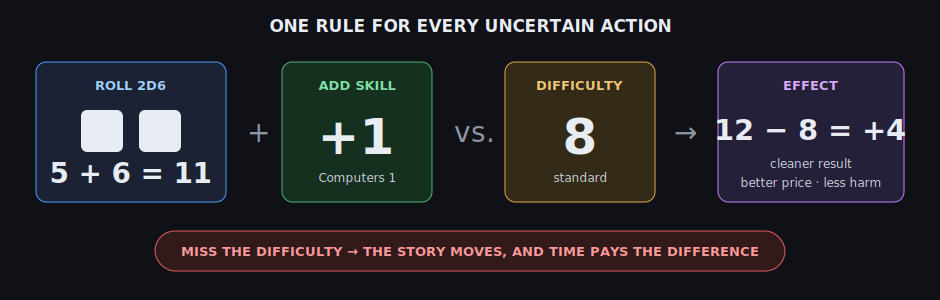

That is the entire resolution system. Audits, orbital surveys, firefights, and seductions are all this rule in different clothes.

---

## 8. SUSPICION

> *"Statistically, most of what goes wrong on a small ship is the universe. The remainder is payroll. My records do not distinguish by intent. That's your job."*

### 8.1 Evidence actions
Declare what you're checking — a log, a lock, a cover story, a crate's seals, a corpse. MAGGIE names the check and applies the **access rule**: you must plausibly be able to reach the thing (be aboard, hold the gear, have the codes, have the body). One day per action. Findings return as fiction, not spreadsheets: *"The bay cycled at 0340, on a valid crew code."*

### 8.2 Confrontations

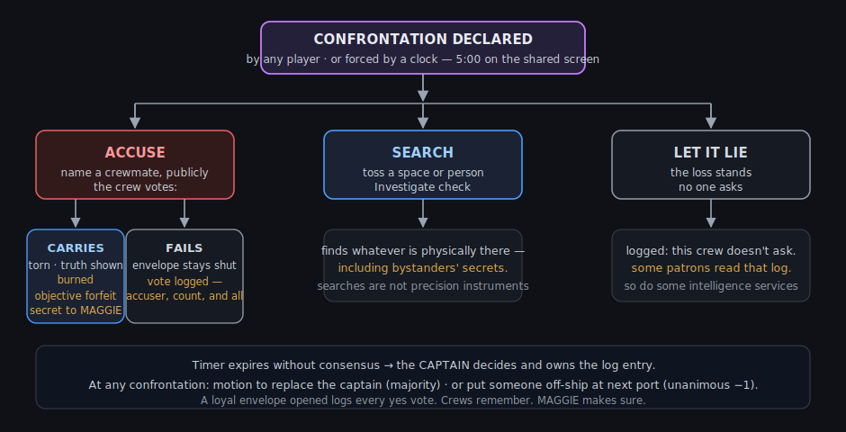

Triggered by any player, or by MAGGIE when a clock demands it. Five minutes on the shared screen. Three resolutions:

- **Accuse.** Name a crewmate and make the case inside the five minutes; then the crew votes, accused included. **A majority carries: the accused must open their envelope.** No refusing, no bargaining — once the count goes against you, the envelope belongs to the crew. It is read aloud: exactly what they are, agenda or no. The opened crewmate is **burned** — their private objective is forfeit, and their secret passes to MAGGIE's timing. A failed vote is logged, accuser and count and all. A vote that opens a **loyal** envelope is logged with every yes attached. Crews remember. MAGGIE makes sure. And yes — you may call the vote on yourself, if proof seems worth the price. The crew is under no obligation to grant it.
- **Search.** Toss a space or a person: Investigate check. A search finds *whatever is physically there* — including bystanders' secrets. Searches are not precision instruments.
- **Let it lie.** The loss stands, and the log records that this crew doesn't ask questions. Some patrons read that log. So do some intelligence services.

**A burned crew member plays on.** Berth, skills, wages, dice, comms windows — all of it continues, and every phone still lights up during the window; the silence protects the burned as much as anyone. What is gone is the private game: no objective, no agenda, nothing left to hide and nothing left to win alone. The ship's fate is their whole score now. Some of the most dangerous people in this game have nothing left to lose and a vote they would like somebody to regret.

Timer expires without consensus → the **captain** decides and owns the entry. At any confrontation a player may instead move to **replace the captain** (majority) or **put someone off at the next port** (unanimous minus one). Both are logged in language the black box will quote back at you.

**Being put off is not being put out.** The exiled player is back aboard within minutes of docking, wearing someone new: MAGGIE keeps a pre-generated **replacement berth** ready at every port — a local hire with a dossier, skills the ship is short of, and a freshly sealed envelope dealt at the published odds — or the player brings in any character from the campaign roster (Section 13). No character creation at the table; the sheet is waiting before the vote finishes, which tells you something about MAGGIE's actuarial tables. The old character walks down the ramp with their pay, their grudges, and a working knowledge of your ship, and MAGGIE folds ex-crew into future patron offers and incidents. You will meet again. Probably at the worst possible moment.

---

## 9. THE FOUR PILLARS

All four run on the beats above. Each adds one flavor of trouble, one clock, and one signature move. Frames mix freely: a survey charter can turn into a firefight over the find, which becomes an intelligence problem about who sold the coordinates.

### 9.1 TRADE — *the margin*
Buy low here, sell high there, across the information horizon. **Clock:** the mortgage. **Evidence:** manifests, ledgers, bay logs. **Signature move — the reckoning:** a funds-counting confrontation where the physical cash on the table is checked against MAGGIE's ledger, and the gap has to be somebody's fault.

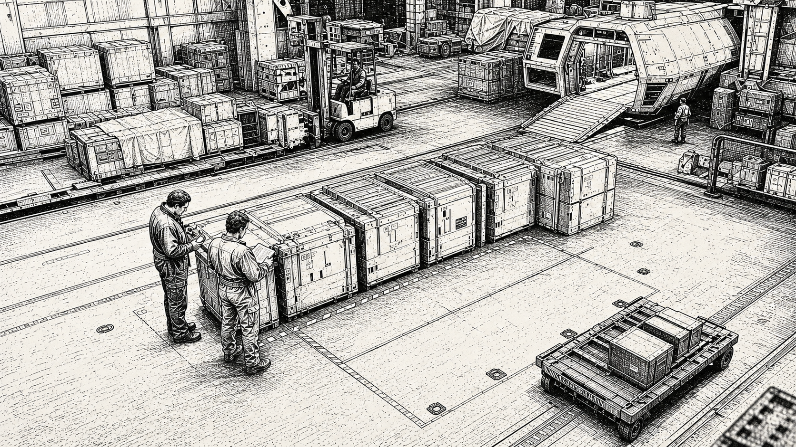
<!-- ART-07 composition prompt: "cargo discrepancy on a worn frontier starport freight dock, two crew compare a manifest with an incomplete row of crates, small merchant ship ramp behind them, no readable text, aspect 16:9" -->

### 9.2 EXPLORATION — *the unknown*
Charters to survey past the charted border — blank hexes on your map that MAGGIE fills only when you spend fuel and nerve getting there. **Clock:** consumables and hull; out there, nothing resupplies. **Evidence:** raw sensor data versus filed surveys. **Signature move — the edge-of-map vote:** press on or turn back, taken at the point where both options are expensive, by a crew in which someone may hold sealed orders that say *press on.* What you survey gets marked on the physical map in your own hand. The map is the campaign's memoir.

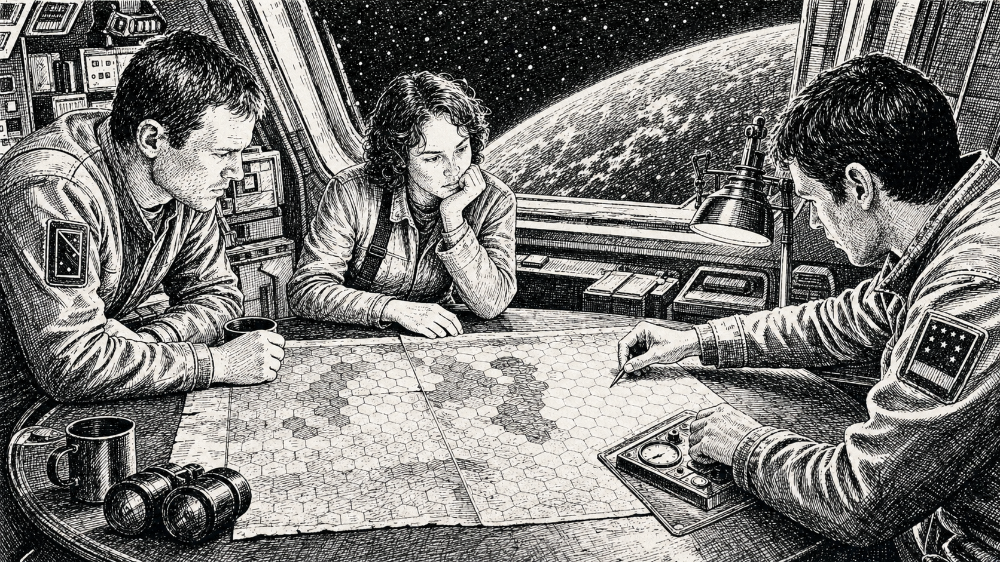
<!-- ART-08 composition prompt: "three crew around a worn paper hex map in a cramped observation compartment, one hand marks a blank border hex, unfamiliar planet through the viewport, one task lamp, no readable text, aspect 16:9" -->

### 9.3 WARFARE — *the ticket*
Mercenary contracts: escort, seizure, security, retrieval. **Clock:** casualties and the contract deadline. **Evidence:** ammo counts, casualty reports, comm intercepts, and the enemy's suspiciously good luck. **Signature move — the engagement:** battles resolve as three command decisions (approach, commitment, extraction), each a check with consequences MAGGIE narrates and tallies — a war story, not a wargame. Afterward comes the **after-action review**, with the black-box excerpt read against everyone's testimony.

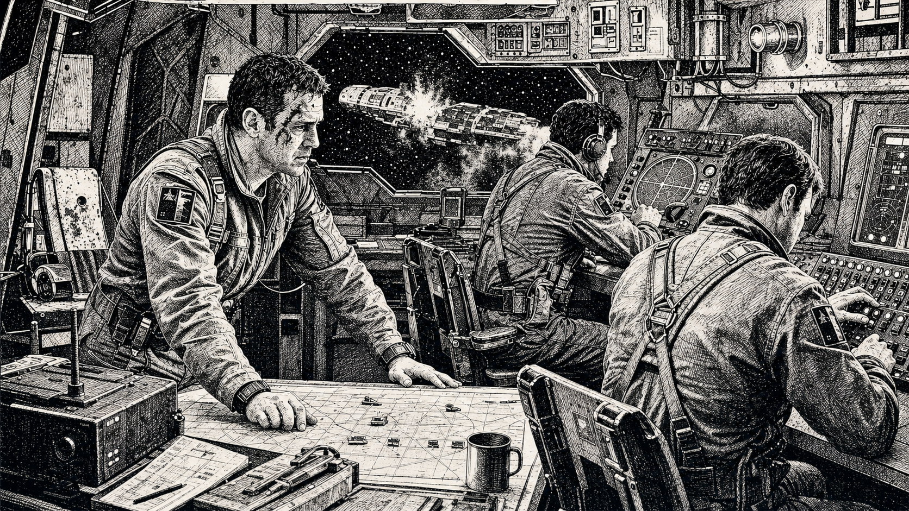
<!-- ART-09 composition prompt: "damaged command compartment during an extraction decision, tired captain at a plotting table, crew at analog controls, depleted indicators and a distant burning escort, no readable text, aspect 16:9" -->

<!-- COMMENT: No diversity in the image. -->

### 9.4 ESPIONAGE — *the secret*
Courier runs, infiltrations, extractions, intel brokerage — the pillar where the cargo is knowledge and the customs check is a conversation. **Clock:** **heat** — attention from services that notice patterns. Heat rises with sloppiness and burns down slowly with distance and discipline. **Evidence:** covers, intercepts, dead drops, travel records. **Signature move — the legend:** for a job, MAGGIE issues cover identities — a small card of facts about who you claim to be. Contradict your legend in play and heat rises; hold it under pressure and doors open. NOTE: espionage frames publish the *highest* agenda odds in the game, and the legend system means even loyal crew are lying professionally. This pillar is not for new tables. It is for tables who thought they were good at the other three.

<!-- ART-05 composition prompt: "two figures exchange identical briefcases on a rain-slick starport concourse, seen from above through a security camera fisheye, crowds in motion around the still figures, espionage thriller mood, aspect 16:9" -->

---

## 10. MONEY AND THE OBLIGATION

All income and expense posts to the shared ledger automatically. Players approve; MAGGIE deducts. **Miss the Obligation** and consequences arrive per frame: the bank forecloses, the charter is voided and stranded, the ticket's employer stops answering, the service that issued your legends starts asking for them back. Every frame's version ends the same way: the ship stops being yours. One grace period, at ruinous terms. MAGGIE is not sentimental about this, and she is the only one of you with a lawyer.

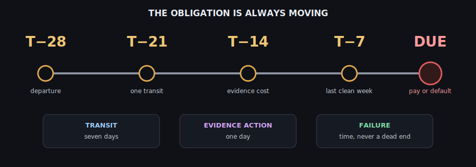

---

## 11. VICTORY

Two scores: the **ship's fate** (shared) and **your objective** (yours alone). They can diverge. That's the game.

**Ship outcomes, per cycle:** **PAID IN FULL** (obligation met, Cr10,000+ remaining) · **SCRAPED BY** (met, nothing left) · **DEFAULT** (campaign ends).

**Personal outcomes:** your private objective **completed**, **failed**, or **forfeited** (burned: the crew voted your envelope open). Completing it is your win regardless of the ship's ledger. Agendas score the same way. Get paid any two ways you like: rich and loyal, poor and treacherous, or the rare clean sweep.

**Campaign end:** obligation retired in full (the grand shared victory) · default · a vote to disband · no crew left standing.

**The black box.** However it ends, MAGGIE prints the full record — every secret roll, every comms-window act, every legend, timestamped, attributed, one section per crew member, read aloud around the table. The black box is not optional. Plan your entire game accordingly.

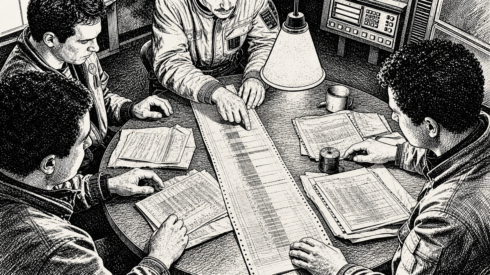
<!-- ART-11 composition prompt: "crew around a worn metal mess table reading a long accordion-fold computer record with opened envelopes and paper evidence, one cone lamp, sober procedural reveal, no readable text, aspect 16:9" -->

---

## 12. PLAYER COUNTS AND THE 1–2 PLAYER GAME

**3–5 players** is the standard game; best at 4. Agenda odds and port richness auto-adjust.

**Solo — "Quiet Ship."** You play the captain; MAGGIE generates **NPC crew** to fill stations. NPCs have competence, a personality line, and — rolled at the published odds — possibly agendas of their own. They act during comms windows like anyone else. Your tools are unchanged: evidence actions, searches, confrontations — except accusation becomes **interrogation**, a Persuade or Intimidate check answered through MAGGIE with the NPC's tells and the oracle behind them. The deduction game survives fully; only the shouting is quieter. (Prefer pure logistics? Set agenda odds to zero in the frame and run the honest-ship campaign.)

**Duo — "Cold Partnership."** Two PCs plus 2–3 NPC crew. Base mode is cooperative: the world and possibly an NPC are the problem. The optional **Cold Start** toggle deals both players envelopes at the published odds — *both, one, or neither* of you may be working a side — which turns a two-hander into a very quiet knife fight. Recommended only for couples with strong communication or siblings with none.

**NPC crew mechanics (both modes):** NPCs roll their own competence when tasked (MAGGIE rolls openly), consume wages and life support, appear in evidence trails exactly like players, and can be searched, accused, confronted, and put off the ship. They cannot be burned — their envelopes stay shut until the black box; interrogation and evidence are your only windows into them. MAGGIE plays them fair and plays them selfish.

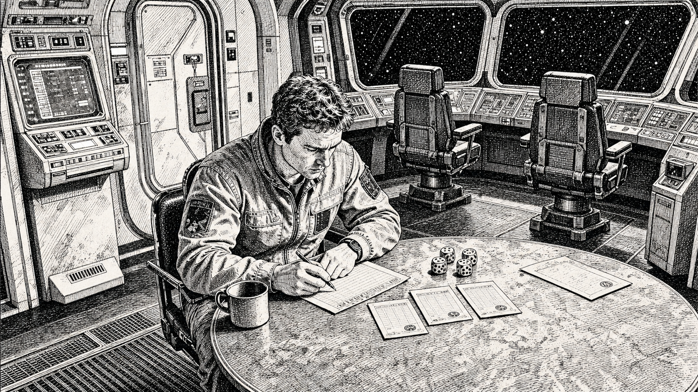
<!-- ART-12 composition prompt: "lone captain at a plotting table with three paper crew dossier cards and physical dice, empty bridge stations and a ship computer around them, quiet transit, no readable text, aspect 16:9" -->

---

## 13. THE TRAVELLER PLUGIN — BRING YOUR OWN CHARACTERS

TELEMETRY ENGINE is system-agnostic; a **plugin** supplies the dice convention, skill list, characteristics, ships, currency, travel rules, and map. The launch plugin is **Traveller** (all editions' characters welcome; terminology follows Mongoose 2e; used under Mongoose Publishing's Fair Use Policy — this is a non-commercial fan work, and Traveller in all forms is © Mongoose Publishing).

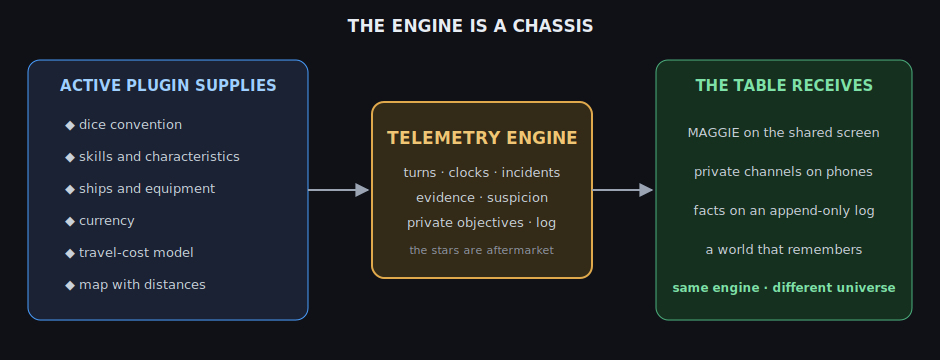

**Importing a character.** Any Traveller character — rolled at a home campaign, in travtools, or on paper in 1981 — joins in Step 2 of setup:
1. Enter name, UPP, and skills into the roster (or import travtools JSON directly). Skills are used as-is; characteristic modifiers apply per standard 2d6 rules.
2. **Careers grant a pillar edge**, once per session: Merchants reroll one Broker check · Scouts ask MAGGIE one free survey question · Army/Marines take a Boon on one engagement decision · Agents receive one extra legend fact · Nobles, Rogues, and everyone else negotiate their edge with MAGGIE at import (she is fair and enjoys precedent).
3. **Benefits post to the ledger:** cash muster-out arrives as funds; ship shares reduce the Obligation's principal; weapons and gear enter inventory.
4. **Contacts, allies, rivals, and enemies from your career become journal seeds.** MAGGIE weaves them into patron offers and incidents. Your old enemy is now procedurally load-bearing. You're welcome.
5. Existing party history can be entered as linking events — your table's canon becomes MAGGIE's canon.

Characters persist in the roster across campaigns, carrying scars, credits, and log excerpts. And what the engine needs from any *other* plugin is exactly the list above: dice convention, skills, characteristics, money, a travel-cost model, and a map with distances. If a setting has those, the engine can hold it upside down and shake it for drama.

---

## 14. EXAMPLE OF PLAY

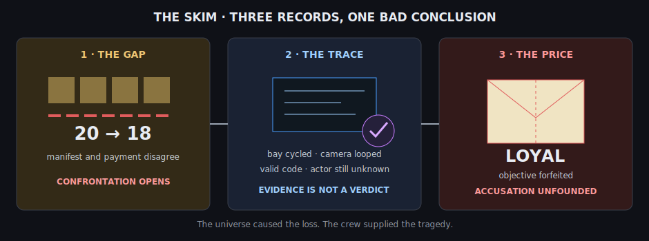

> *The crew of the Free Trader* Margin Call *— Zhan (captain, ex-Merchant), Deuce (ex-Marine), Dr. Brennan (ex-Scout) — Turn 2, ARRIVAL beat at Halcyon Reach, hex 2114. The players plotted the two-parsec route themselves on travellermap; fuel deducted; the mortgage shows T-15 days.*
>
> **MAGGIE:** "Transfer complete. Reach Consolidated has remitted Cr169,200 against a 20-ton manifest. Their receiving master's note: *'Paid as delivered. Eighteen crates.'*"
> **ZHAN:** "Eighteen. No. Manifest history — I'm pulling revisions. Admin." *(rolls 5 + 1 = 6)*
> **MAGGIE:** "Difficulty 8. The revision log is a thicket of routine countersignatures; nothing isolates in the time you have. That cost a day. T-14."
> **BRENNAN:** "Bay lock log. Computers." *(rolls 10 + 1 = 11)*
> **MAGGIE:** "Effect +3 — full picture. The bay cycled once outside the loading schedule: Vantage, departure day, 0340 ship time. A valid crew code. And the aft bay camera was set to loop at 0332."
> **DEUCE:** "I ran that loading."
> **ZHAN:** "You also voted to take the mystery box."
> **MAGGIE:** "A confrontation has been declared. Five minutes." *(timer appears; the ticker logs: CONFRONTATION — ACCUSER: OKONKWO)*
> *Four loud minutes later, Zhan formally accuses Deuce and calls the vote. Brennan hesitates, then sides with the captain: two to one. Deuce slides his envelope across the table and tears it open himself: LOYAL — burned, private objective forfeited.*
> **MAGGIE:** "Accusation resolved: unfounded, and logged. For the record: the 0340 cycle used the captain's duty override — a code your engineer, discharged at Vantage three weeks ago *for cause*, never returned. Dock pilferage with inside help is common on C-class ports. Funds: Cr194,400 against Cr154,000 due in 14 days. Next market feed at 0800. The camera has been repaired. Sleep well."
>
> *Nobody was a traitor. The crew now has a logged false accusation, a forfeited secret MAGGIE will spend later, and a captain whose override code is dirty. Turn 3 is going to be talkative.*

---

## APPENDIX A — WHAT GOES WRONG (spoiler-safe)

Incidents arrive in families; knowing the families is fair, knowing the tells is the game. **Shortfalls** (things not where the record says) · **Substitutions** (things that aren't what their papers claim) · **Leaks** (enemies who knew too much) · **Malfunctions** (failures maintenance can't explain) · **Ghosts** (records too clean, cameras looped, covers too perfect) · **Claims** (someone else's flag on your find) · **Bad Tickets** (contracts wrong from the start). Every family has honest causes and dishonest ones, tuned so a good crew still guesses wrong sometimes. When you accuse correctly, savor it.

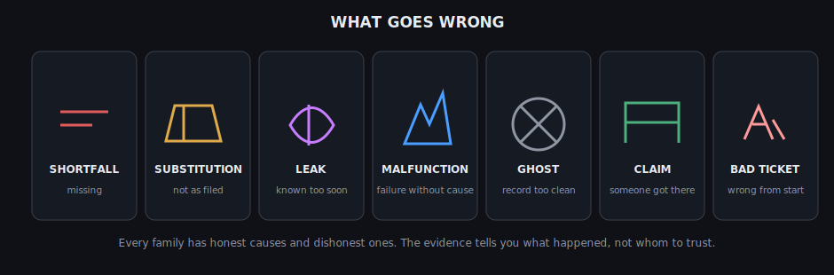

## APPENDIX B — TABLE NOTES

- The comms-window silence is the one etiquette rule that matters. Protect the ritual; everything else works.
- Session shape: one cycle (4 turns) is an evening. Campaigns persist; MAGGIE keeps the world, the log, and the grudges.
- House-rule surface: difficulties, agenda odds, timer lengths, and heat decay live in Settings. Everything else, take up with the bank.
- Espionage frames after your table has a cycle of trade behind it. Trust us. Or don't; that's on-theme.

## APPENDIX C — QUICK REFERENCE

| Do this | When |
|---|---|
| Roll 2d6 + skill vs. difficulty | MAGGIE asks (8 standard) |
| Find the hex, count the parsecs, name it | Every TRANSIT |
| Phones up, 30 seconds, silence | Every COMMS window |
| Evidence action = 1 day | DOCKSIDE or ARRIVAL |
| Accuse / search / let it lie | Confrontations, 5:00 |
| Vote an envelope open = burned: truth + forfeit | Majority at a confrontation; once each, ever |
| Mind the staleness tag | Every feed, every rumor |
| The Obligation | Always. Yes, always. |

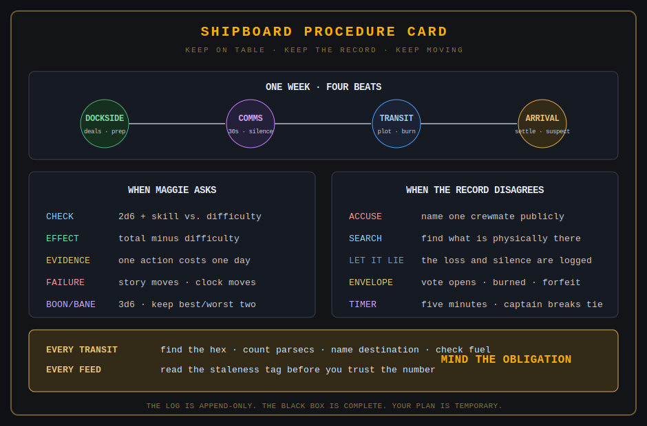

## GLOSSARY

**Agenda** — secret work against the crew's interest; held by all, some, or none. · **Beat** — one of the four phases of a turn (DOCKSIDE, COMMS, TRANSIT, ARRIVAL). · **Black box** — end-of-campaign ground truth, printed and read aloud. · **Boon/Bane** — 3d6 keep best/worst two. · **Burned** — voted open by the crew; truth shown, private game over, still aboard. · **Check** — 2d6 + skill vs. difficulty (plugin-defined). · **Comms window** — the timed, universal, silent private phase. · **Effect** — margin of success; MAGGIE converts it to outcomes. · **Engagement** — warfare's three-decision battle resolution. · **Envelope** — your sealed identity; the crew can vote it open, burning its holder. · **Frame** — a campaign configuration: lead pillar, Obligation, agenda odds. · **Heat** — espionage's clock: institutional attention, slow to cool. · **Information horizon** — news is stale by one week per parsec; every feed is tagged. · **Jump rating** — parsecs per transit; the leash on your ambitions. · **Legend** — an issued cover identity; contradict it and heat rises. · **MAGGIE** — *Manifest Auditing, General Governance & Incident Evaluation*; the Traveller plugin's ship's-computer persona — referee, recordkeeper, and the bank's most local representative. That expansion is what the lease paperwork says; crews of the *Margin Call* insist it's just short for the ship's name. Both are true, and MAGGIE declines to settle it. · **NPC crew** — MAGGIE-run crew in 1–2 player games; searchable, accusable, occasionally guilty. · **Obligation** — the frame's doom clock; the game's true antagonist. · **Pillar** — one of four trouble genres: trade, exploration, warfare, espionage. · **Plugin** — the rules-and-setting module under the engine; Traveller is the launch plugin. · **Staleness tag** — the age of any information, in weeks, always shown. · **The reckoning / edge-of-map vote / after-action review / unmasking** — the four pillars' signature confrontations.

---

*TELEMETRY ENGINE is a chassis; the stars are aftermarket. The Traveller game in all forms is owned by Mongoose Publishing. Copyright 1977–2026 Mongoose Publishing. This is a non-commercial fan work under the Traveller Fair Use Policy. All original engine design and text © the designer.*

<!-- ART-06 composition prompt: "small merchant starship seen from far behind approaching a vast ringed gas giant, ship tiny and off-center, starfield crossed by faint hexagonal chart lines, melancholy scale, large negative space, no text, aspect 2:3" -->
